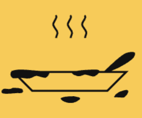

<p align="center">
  
</p>
<p align="center">
  
</p>

# Stoveside: *Flavor starts here*


## Introduction
Stoveside is a modern, full-stack recipe app designed for food lovers and home cooks. Discover global recipes, add your own, and enjoy a beautiful, responsive dark mode UI. Whether you're logged in or offline, your recipes are always accessible.

---

## Branding
- **Logo:** Pan icon (`logo.png`), visible on a light background in the navbar
- **Name:** Stoveside
- **Tagline:** Flavor starts here
- **Theme:** Dark mode with blue and white accents, modern and accessible

---


## Features
- 🌙 **Dark Mode:** Consistent dark UI with blue/white accents
- 🌏 **Global Recipes:** Browse recipes from TheMealDB
- 📝 **User Recipes:** Add, view, and manage your own recipes (stored in MongoDB if logged in, or local storage if offline)
- 🔒 **Authentication:** Register and log in to save your recipes
- 📱 **Responsive Design:** Works great on desktop and mobile
- 🔍 **Search & Filter:** Find recipes by ingredient, title, or cuisine
- 🖼️ **Modern UI:** Clean, accessible, and visually appealing
- ⚡ **Fast & Offline:** User recipes available even without an internet connection
- 🥘 **Add Recipe:** Simple form to add your own creations
- 🧭 **Easy Navigation:** Intuitive navbar, mobile drawer, and clear calls to action

---

## Tech Stack
- **Frontend:** [React](https://reactjs.org/), [Material-UI](https://mui.com/), [Framer Motion](https://www.framer.com/motion/)
- **Backend:** [Node.js](https://nodejs.org/), [Express](https://expressjs.com/)
- **Database:** [MongoDB](https://www.mongodb.com/) (Atlas or local), Local Storage (offline)
- **API:** [TheMealDB](https://www.themealdb.com/) for global recipes

---

## Project Structure
```
recipe-finder/
├── client/                 # React frontend
│   ├── public/             # Static assets (logo, favicon, etc.)
│   │   ├── components/     # Navbar, RecipeCard, etc.
│   │   ├── pages/          # Home, Login, Register, RecipeDetail, AddRecipe
│   │   ├── utils/          # API utilities
│   │   └── App.js          # Main app component
│   └── package.json
├── server/                 # Node.js backend
│   ├── models/             # MongoDB schemas
│   ├── routes/             # API routes
│   ├── controllers/        # Route controllers
│   ├── middleware/         # Custom middleware
│   ├── server.js           # Main server file
│   └── package.json
└── README.md
```

---

## Getting Started

### Prerequisites
- Node.js (v16+ recommended)
- npm or yarn
- MongoDB Atlas account (or local MongoDB)

### Setup
#### 1. Clone the repository
```bash
git clone <repo-url>
cd stoveside
```
#### 2. Backend Setup
```bash
cd server
npm install
# Create a config.env file (see config.env.example)
# Set MONGO_URI and JWT_SECRET
npm start
```
#### 3. Frontend Setup
```bash
cd ../client
npm install
npm start
```
The app will run at [http://localhost:3000](http://localhost:3000)

---

## Usage
- **Browse Recipes:** See global recipes on the home page
- **Search & Filter:** Use the search bar and cuisine filter
- **Add Recipe:** Log in and add your own recipes
- **Mobile Friendly:** Use on any device
- **Dark Mode:** Enjoy a beautiful, accessible interface day or night

---

## Customization
- Update theme colors in the client/src/components and pages CSS/JS files
- Change TheMealDB API usage in `client/src/utils/api.js`
- Replace the logo in `client/public/logo.png` if you want a different pan or color
- Edit the tagline or branding in the navbar and README

---

## Contributing
1. Fork the repository
2. Create a feature branch
3. Make your changes
4. Test thoroughly
5. Submit a pull request

---

## FAQ
**Q: Can I use Stoveside offline?**
> Yes! Your own recipes are saved in local storage if you're not logged in.

**Q: How do I change the logo or theme?**
> Replace `client/public/logo.png` and update theme colors in the CSS/JS files.

**Q: Where do global recipes come from?**
> They are fetched from [TheMealDB](https://www.themealdb.com/).

**Q: Is this project open source?**
> Yes, released under the MIT License.

---

## Contact
For questions, suggestions, or collaboration:
- GitHub: [rishis26/stoveside](https://github.com/rishis26/stoveside)
- Email: _rishishah781@gmail.com_