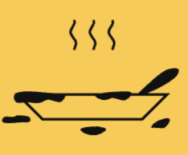

<p align="center">
  
</p>

<p align="center">
  
</p>

# StoveStory Client

A modern, responsive web app for discovering, searching, and adding global and personal recipes. Features a beautiful dark mode UI, offline support, and seamless integration with TheMealDB API.

---

## Features
- 🌙 **Dark Mode:** Consistent, accessible dark UI
- 🌏 **Global Recipes:** Browse and search recipes from TheMealDB
- 📝 **User Recipes:** Add and manage your own recipes (stored in MongoDB if logged in, or local storage if offline)
- 🔒 **Authentication:** Register and log in to save your recipes
- 📱 **Responsive Design:** Works great on desktop and mobile
- 🔍 **Search & Filter:** Find recipes by ingredient, title, or cuisine
- ⚡ **Offline Support:** User recipes available even without internet

---

## How It Works
- Search or filter recipes on the home page (fetched from TheMealDB API)
- View full details, ingredients, and instructions for each recipe
- Add your own recipes (saved locally or to your account)
- Enjoy a fast, modern, mobile-friendly experience

---

## Getting Started
1. Install dependencies:
   ```bash
   npm install
   ```
2. Start the development server:
   ```bash
   npm start
   ```
3. Open [http://localhost:3000](http://localhost:3000) in your browser.

---

## Notes
- Global recipes are fetched from TheMealDB API
- Added recipes are stored in your browser's local storage if not logged in
- No authentication required for local recipes; login to sync with backend

---

## Customization
- Update theme colors in the CSS/JS files in `src/components` and `src/pages`
- Replace the logo in `public/logo.png` for your own branding

---

Enjoy discovering and adding recipes with StoveStory!
